<h1 align="center">Hi 👋, I'm Ashfaq</h1>
<h3 align="center">I'm passionate about building high-quality software and AI/ML solutions that address real-world challenges. I enjoy collaborating with fellow developers and often work with open-source tools to build scalable, efficient systems. I'm always exploring better ways to solve problems through clean architecture, thoughtful design, and continuous learning.</h3>

  

- 🔭 I'm currently working on **Software Development, Container & Orchestration, Applied AI, System Design, Apache Flink**

- 🌱 I'm currently learning **System Design**

- 👯 Let's collaborate on **Software Development, Applied AI**

- 💬 Ask me about **Software Development, Container & Orchestration, Messaging Queues, Applied AI, System Design, Apache Flink**

- 📫 How to reach me   

## 🧰 Languages and Tools

### 💻 Programming Languages

  
  
  
  
  
  
  
  
  <!--  -->

### 🔧 Backend Development

  
  
  
  
  
  
  
  
  
  
  
  
  
  
  

### 💾 Databases

  
  
  
  
  
  
  
  
  

### ☁️ Cloud & DevOps

  
  
  
  
  
  
  
  
  
  
  

### 📨 Data Processing & Messaging

  
  
  
  
  

### 📊 Monitoring & Observability

  
  
  
  
  

### 🌐 Frontend Development

  
  
  
  
  
  
  

 

## 🌐 Technical Skills Universe

```mermaid
graph LR
    %% Central node
    ASHFAQ[🌟 ASHFAQ 🌟]

    %% Core Programming Languages
    ASHFAQ --- LANG[⌨️ Programming Languages]
    LANG --- JAVA[☕ Java]
    LANG --- PYTHON[🐍 Python]
    LANG --- JS[🟨 JavaScript]
    LANG --- GO[🔷 Golang]

    %% Backend Development
    ASHFAQ --- BACKEND[🔧 Backend Development]
    BACKEND --- SPRING[🌱 Spring Framework]
    BACKEND --- FASTAPI[⚡ FastAPI]
    BACKEND --- FLASK[🔥 Flask]
    BACKEND --- EXPRESS[📟 Express.js]

    %% System Design
    ASHFAQ --- SYSDES[🏛️ System Design]
    SYSDES --- HLD[📊 High Level Design]
    SYSDES --- LLD[🔩 Low Level Design]

    %% AI/ML
    ASHFAQ --- AI[🧠 Artificial Intelligence]
    AI --- ML[⚙️ Machine Learning]
    AI --- RAG[📖 RAG Systems]
    AI --- LLM[🔬 LLM Tuning & Evaluation]
    AI --- AGENTS[🤖 AI Agents]
    AI --- MCP[🔗 MCP]

    %% Database Expertise
    ASHFAQ --- DB[💾 Database Technologies]
    DB --- POSTGRES[🐘 PostgreSQL]
    DB --- MONGODB[🍃 MongoDB]
    DB --- REDIS[🔴 Redis]
    DB --- ORACLE[🏛️ Oracle]
    DB --- ROCKSDB[⛰️ RocksDB]

    %% Container & Cloud Native
    ASHFAQ --- CONTAINER[📦 Container Orchestration]
    CONTAINER --- K8S[☸️ Kubernetes]
    CONTAINER --- DOCKER[🐳 Docker]
    CONTAINER --- PODMAN[🦭 Podman]

    %% Cloud Platforms
    ASHFAQ --- AWS[☁️ Amazon Web Services]
    AWS --- EC2[🖥️ EC2]
    AWS --- RDS[🗄️ RDS]
    AWS --- S3AWS[🗂️ S3]
    AWS --- EB[🚀 Elastic Beanstalk]

    ASHFAQ --- GCP[🌐 Google Cloud Platform]
    GCP --- S3GCP[☁️ Cloud Storage]

    %% Messaging & Streaming
    ASHFAQ --- MQ[📨 Message Queue Systems]
    MQ --- KAFKA[🌊 Apache Kafka]
    MQ --- RABBITMQ[🐰 RabbitMQ]
    MQ --- AWSSQS[📬 AWS SQS]

    %% ETL & Data Processing
    ASHFAQ --- ETL[🔄 Data Processing Pipeline]
    ETL --- FLINK[💧 Apache Flink]
    ETL --- BEAM[🌈 Apache Beam]

    %% Performance & Testing
    ASHFAQ --- PERF[📈 Performance Engineering]
    PERF --- JMETER[⚡ JMeter]

    %% Frontend
    ASHFAQ --- FRONTEND[🌐 Frontend Development]
    FRONTEND --- REACT[⚛️ React]

    %% Styling
    style ASHFAQ fill:#ff1744,stroke:#fff,stroke-width:5px,color:#fff
    style LANG fill:#2e7d32,stroke:#fff,stroke-width:3px,color:#fff
    style BACKEND fill:#1565c0,stroke:#fff,stroke-width:3px,color:#fff
    style SYSDES fill:#6a1b9a,stroke:#fff,stroke-width:3px,color:#fff
    style AI fill:#d84315,stroke:#fff,stroke-width:3px,color:#fff
    style DB fill:#00838f,stroke:#333,stroke-width:2px,color:#fff
    style CONTAINER fill:#558b2f,stroke:#333,stroke-width:2px,color:#fff
    style AWS fill:#ff8f00,stroke:#333,stroke-width:2px
    style MQ fill:#5e35b1,stroke:#333,stroke-width:2px,color:#fff
    style ETL fill:#00acc1,stroke:#333,stroke-width:2px
    style GCP fill:#3949ab,stroke:#333,stroke-width:2px,color:#fff
    style PERF fill:#43a047,stroke:#333,stroke-width:2px
    style FRONTEND fill:#1976d2,stroke:#333,stroke-width:2px,color:#fff
```

<h1 dir="auto"></h1>

## GitHub Stats

&nbsp;

## Language Stats

## Streak Stats

## Favorite Quote

> "The best way to predict the future is to invent it." - Alan Kay

## Thanks for stopping by!

I hope you enjoyed learning a little bit about me. If you have any questions or would like to connect, please feel free to [reach out to me on LinkedIn](https://www.linkedin.com/in/b-s-mohammed-ashfaq/)!

###
